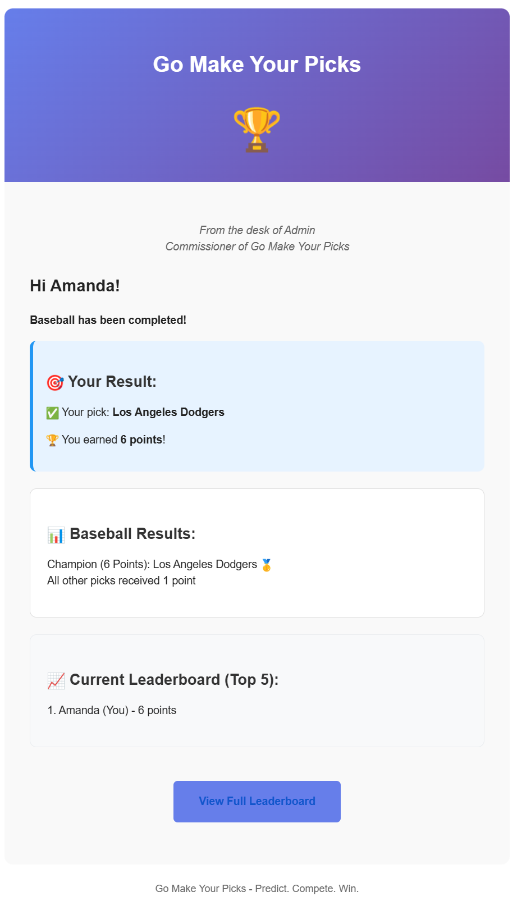

# 🏆 Go Make Your Picks

[](https://github.com/andrewbusbee/go-make-your-picks/releases)


[](https://github.com/andrewbusbee/go-make-your-picks/commits/main)

A modern, player-friendly sports prediction platform that brings people together through friendly competition. Create seasons, predict champions, and track player picks across multiple sports.

## ✨ Features

### For Players
- **No Registration Required** - Access picks via secure email links
- **Multiple Sports** - Baseball, Basketball, Tennis, Golf, and more
- **Real-time Leaderboards** - See who's winning in real-time
- **Progress Tracking** - Visual graphs showing point accumulation over time
- **Mobile Friendly** - Works perfectly on phones, tablets, and computers

### For Administrators
- **Season Management** - Create and manage multiple competition seasons
- **Flexible Scoring** - Customize point values for different placements
- **Automated Reminders** - System sends timely reminders to players
- **User Management** - Add and manage players easily
- **Admin Controls** - Create additional admin accounts with proper permissions

## 📸 Screenshots

### Public Pages

| Player Leaderboard | Completed Season Standings |
|:---:|:---:|
|  |  |

| Previous Season Champions | Player Pick Page |
|:---:|:---:|
|  |  |

### Player Email Messages

| Player Pick Email | Player Reminder Email |
|:---:|:---:|
|  |  |

| Sport Lock Email | Sport Result Email |
|:---:|:---:|
|  |  |


### Admin Pages

| Getting Started Page | App Customization |
|:---:|:---:|
|  |  |

| Season Management | Sport Management |
|:---:|:---:|
|  |  |

| Player Settings | Pick Management |
|:---:|:---:|
|  |  |

### Admin Emails

| Admin Summary Email |
|:---:|
|  |


## 🚀 Quick Start

### Prerequisites
- Docker and Docker Compose
- Email service credentials (Gmail, SendGrid, etc.)

### Setup Steps

1. **Copy environment template**:
   ```bash
   cp env.template .env
   ```

2. **Generate a JWT secret** (required for security):
   ```bash
   node -e "console.log(require('crypto').randomBytes(32).toString('hex'))"
   ```
   Copy the output and add it to your `.env` file as `JWT_SECRET=...`

3. **Fill in required variables** in `.env`:
   - `JWT_SECRET` - Use the value from step 2
   - `MARIADB_ROOT_PASSWORD` - Strong password for MariaDB root
   - `MARIADB_PASSWORD` - Strong password for the application database user
   - `SMTP_HOST` - Your email server (e.g., `smtp.gmail.com`)
   - `SMTP_USER` - Your email address
   - `SMTP_PASSWORD` - Your email app password (see Email Setup Guide below)

4. **Start the application**:
   ```bash
   docker-compose up -d
   ```

5. **Wait for initialization** (30-60 seconds on first start):
   - The database needs time to initialize
   - Check logs: `docker-compose logs -f`

6. **Access the application**:
   - Frontend: http://localhost:3003
   - Admin Panel: http://localhost:3003/admin/login
   - API Docs: http://localhost:3003/api/docs

### First-Time Setup

**Default Admin Login:**
- Username: `admin@example.com`
- Password: `password`

⚠️ **You'll be prompted to change the password on first login**

## 🐳 Installation via Docker Compose (Recommended)

The application is designed to run with Docker Compose, providing a complete stack with MariaDB database and the application server. This approach ensures consistent deployment across different environments and simplifies setup.

```yaml
services:
  mariadb:
    image: mariadb:11.8
    container_name: mariadb
    restart: always
    networks:
      - go-make-your-picks-network
    volumes:
      - mariadb-data:/var/lib/mysql
    environment:
      MARIADB_ROOT_PASSWORD: ${MARIADB_ROOT_PASSWORD}
      MARIADB_DATABASE: ${MARIADB_DATABASE:-gomakeyourpicks}
      MARIADB_USER: ${MARIADB_USER:-gomakeyourpicksuser}
      MARIADB_PASSWORD: ${MARIADB_PASSWORD}
    healthcheck:
      test: ["CMD", "mariadb-admin", "ping", "-h", "localhost"]
      timeout: 20s
      retries: 10

  go-make-your-picks:
    image: ghcr.io/andrewbusbee/go-make-your-picks:latest
    container_name: go-make-your-picks
    restart: always
    depends_on:
      mariadb:
        condition: service_healthy
    networks:
      - go-make-your-picks-network
    ports:
      - "3003:3003"
    environment:
      # Runtime Environment Configuration
      # NODE_ENV controls runtime behavior (production vs development) for Express, logging, CORS, etc.
      # In production, enables production-safe settings (optimized builds, tighter CORS, less verbose logging, limited error details)
      NODE_ENV: production

      # Database Configuration
      MARIADB_HOST: mariadb
      MARIADB_PORT: 3306
      MARIADB_DATABASE: ${MARIADB_DATABASE:-gomakeyourpicks}
      MARIADB_USER: ${MARIADB_USER:-gomakeyourpicksuser}
      MARIADB_PASSWORD: ${MARIADB_PASSWORD}
      
      # Application Configuration
      APP_URL: ${APP_URL:-http://localhost:3003}
      LOG_LEVEL: ${LOG_LEVEL:-INFO}
      ENABLE_DEV_TOOLS: ${ENABLE_DEV_TOOLS:-false}
      
      # Security Configuration
      # ⚠️ CRITICAL SECURITY: Generate a strong JWT secret!
      # Run: node -e "console.log(require('crypto').randomBytes(32).toString('hex'))"
      JWT_SECRET: ${JWT_SECRET}
      JWT_EXPIRY: ${JWT_EXPIRY:-8h}

      # SMTP Configuration
      SMTP_HOST: ${SMTP_HOST:-}
      SMTP_PORT: ${SMTP_PORT:-587}
      SMTP_SECURE: ${SMTP_SECURE:-false}
      SMTP_USER: ${SMTP_USER:-}
      SMTP_PASSWORD: ${SMTP_PASSWORD:-}
      SMTP_FROM: ${SMTP_FROM:-noreply@example.com}

networks:
  go-make-your-picks-network:
    driver: bridge
    internal: false  # false required for magic link functionality

volumes:
  mariadb-data:
```

## ⚙️ Environment Variables

### Environment Variable Syntax

In `docker-compose.yml`, you'll see environment variables written like `${VARIABLE_NAME:-default_value}`. This syntax means:
- **`${VARIABLE_NAME}`** - Uses the value from your `.env` file or environment if set
- **`:-default_value`** - If the variable is not set or is empty, use `default_value` instead
- **Example**: `${LOG_LEVEL:-INFO}` means "use LOG_LEVEL from .env if set, otherwise use INFO"

Variables without a default (like `${JWT_SECRET}`) are **required** and must be set in your `.env` file or environment.

### Required Configuration

These variables must be set in your `.env` file or environment (no defaults):

| Variable | Description | Example |
|----------|-------------|---------|
| `MARIADB_ROOT_PASSWORD` | Database root password (for MariaDB service) | `your-root-password` |
| `MARIADB_PASSWORD` | Database password for the application user | `your-secure-password` |
| `JWT_SECRET` | Secret key for admin authentication (minimum 32 characters) | `generate-a-strong-random-string` |
| `SMTP_HOST` | Email server hostname | `smtp.gmail.com` |
| `SMTP_USER` | Email account username | `your-email@gmail.com` |
| `SMTP_PASSWORD` | Email account password/app password | `your-app-password` |

### Recommended to Change from Defaults

These variables have default values but it is **highly recommended that they be changed** for your deployment:

| Variable | Description | Default | Example |
|----------|-------------|---------|---------|
| `MARIADB_DATABASE` | Database name | `gomakeyourpicks` | `gomakeyourpicks` |
| `MARIADB_USER` | Database username | `gomakeyourpicksuser` | `gomakeyourpicksuser` |
| `APP_URL` | Your application's public URL | `http://localhost:3003` | `https://yourdomain.com` |
| `LOG_LEVEL` | Logging verbosity level | `INFO` | `DEBUG`, `INFO`, `WARN`, `ERROR`, `FATAL`, `SILENT` |
| `ENABLE_DEV_TOOLS` | Enable creation of seed data from admin dashboard for testing | `false` | Set to `false` for production |
| `JWT_EXPIRY` | JWT access token expiry (magic links auto expire when round locks) | `8h` | `8h`, `30m`, `1d` |
| `SMTP_PORT` | Email server port | `587` | `587` or `465` |
| `SMTP_SECURE` | Use SSL/TLS encryption (set to false for port 587) | `false` | `true` or `false` |
| `SMTP_FROM` | Sender email address (fallback used if not set) | `noreply@example.com` | `noreply@yourdomain.com` |

**Note on `ENABLE_DEV_TOOLS`**: 
- Default is `false` and can be set to `true` for development/testing convenience
- **Must be set to `false` for production** to hide seed data buttons and prevent accidental data creation
- Can be toggled anytime by changing the value and restarting Docker Compose (no rebuild required)

### Docker Internal Configuration (Do Not Change)

These values are set in `docker-compose.yml` for Docker networking and should not be modified unless you understand the impacts:

| Variable | Description | Default |
|----------|-------------|---------|
| `MARIADB_HOST` | Database host (Docker service name) | `mariadb` |
| `MARIADB_PORT` | Database port (internal Docker port) | `3306` |
| `NODE_ENV` | Runtime environment mode (production vs development) | `production` |

### NODE_ENV

`NODE_ENV` controls the runtime mode for the backend application:

- **`production`** – Used in Docker / deployed environments. Enables production-safe settings:
  - Optimized builds and performance
  - Tighter CORS restrictions (only explicitly allowed origins)
  - Less verbose logging (default log level: `info`)
  - Limited error details (no stack traces in responses)
  - Security headers enabled
  - Admin-only API documentation

- **`development`** – Used for local development. Enables development-friendly settings:
  - Verbose logging (default log level: `debug`)
  - Permissive CORS for localhost origins
  - Detailed error messages with stack traces
  - Public API documentation (no authentication required)

**Configuration:**
- In `docker-compose.yml`, the backend service is configured with `NODE_ENV=production` by default.
- For local development, use `NODE_ENV=development` via `docker-compose.override.yml` or `.env` file.
- The Dockerfile sets `ENV NODE_ENV=production` in the production stage, but Docker Compose environment variables take precedence.

### Development vs Production

**Development/Testing (`ENABLE_DEV_TOOLS=true`):**
- Seed data buttons visible in admin dashboard
- Useful for exploring features and testing
- Default value for convenience
- Can create/delete sample data easily

**Production (`ENABLE_DEV_TOOLS=false`):**
- Seed data buttons hidden
- No risk of accidentally creating test data
- Recommended for live deployments
- Set this before deploying to production

**Important:** Always delete any sample data (using "Delete Sample Data" button) before setting `ENABLE_DEV_TOOLS=false` and deploying to production.

## 🌱 Seed Data Function

The seed data function is a development/testing tool that populates your database with sample data to help you explore the application quickly. When enabled (via `ENABLE_DEV_TOOLS=true`), you can access it from the admin dashboard.

**What it creates:**
- 15 sample players (Player 01 through Player 15) with sample email addresses (player1@example.com through player15@example.com)
- A test season with the current year and next year
- 10 sports total:
  - 2 active sports with lock times set to 1 week from now
  - 8 completed sports with historical scores and picks
  - "Wimbledon" is included as a write-in sport (active, not locked)
- Sample picks for all players across all sports (picks are validated against actual team lists)

**Note:** This feature is intended for development and testing purposes only. It should be disabled (`ENABLE_DEV_TOOLS=false`) in production environments, and any sample data should be deleted using the "Delete Sample Data" button in the admin dashboard before going to production.

## 📧 Email Setup Guide

### Gmail Configuration

1. **Enable 2-Factor Authentication** on your Google account
2. **Generate an App Password**:
   - Go to Google Account → Security
   - App passwords → Select "Mail" and your device
   - Copy the generated 16-character password
3. **Use the app password** in your `SMTP_PASSWORD` variable

### Testing Email Configuration

Use the built-in email test feature in the admin panel:
1. Go to **Settings** → **Email**
2. Click "Send Test Email"

### Email Provider Examples

**Gmail:**
```env
SMTP_HOST=smtp.gmail.com
SMTP_PORT=587
SMTP_SECURE=false
SMTP_USER=your-email@gmail.com
SMTP_PASSWORD=your-16-character-app-password
```

**SendGrid:**
```env
SMTP_HOST=smtp.sendgrid.net
SMTP_PORT=587
SMTP_SECURE=false
SMTP_USER=apikey
SMTP_PASSWORD=your-sendgrid-api-key
```

**Brevo (formerly Sendinblue):**
```env
SMTP_HOST=smtp-relay.brevo.com
SMTP_PORT=587
SMTP_SECURE=false
SMTP_USER=your-email@domain.com
SMTP_PASSWORD=your-brevo-smtp-key
```

## 🎯 Getting Started Guide

### For Administrators

1. **Login** to the admin panel with your credentials
2. **Change your password** when prompted
3. **Add players** in the "Players" section
4. **Create a season** (e.g., "2025 League Championship")
5. **Add sports/rounds** for your season:
   - Set sport name and lock date
   - Add available teams or enable write-in picks
   - Include a custom message for players
6. **Activate rounds** to send magic links to everyone
7. **Complete rounds** after championships to calculate scores

### For Players

1. **Check your email** for magic link invitations
2. **Click the link** to access your pick form
3. **Make your predictions** before the lock time
4. **Update your picks** anytime before the deadline
5. **View the leaderboard** to see how everyone is doing

## 🛠️ Technical Details

### Architecture
- **Frontend**: React 18 with TypeScript and Tailwind CSS
- **Backend**: Node.js 24 with Express and TypeScript
- **Database**: MariaDB 11.8 LTS with comprehensive schema
- **Email**: Configurable SMTP with automatic retry logic
- **Deployment**: Docker containers with health checks

### Security Features
- JWT-based admin authentication
- Magic link tokens for player and alternate admin access
- Bcrypt password hashing
- SQL injection protection
- Input validation and sanitization

## API Documentation

Complete API documentation is available at `http://localhost:3003/api/docs` - this provides a comprehensive list of all available endpoints, their methods, required parameters, and response formats.

## 🔍 Troubleshooting

### Common Issues

**Port 3003 Already in Use:**
- Check what's using the port: `netstat -ano | findstr :3003` (Windows) or `lsof -i :3003` (Linux/Mac)
- Change the port in `docker-compose.yml` if needed: `"3004:3003"` (maps host port 3004 to container port 3003)
- Update `APP_URL` in your `.env` file to match the new port

**Magic Links Not Sending:**
- Verify SMTP credentials in your configuration
- Check that your email provider allows SMTP connections
- Use the built-in email test feature in admin settings (Settings → Email → Send Test Email)
- Check server logs: `docker-compose logs go-make-your-picks`

**Database Connection Problems:**
- Ensure MariaDB container is running: `docker-compose ps`
- Wait for database initialization (30-60 seconds on first start)
- Verify database credentials match your configuration
- Check database logs: `docker-compose logs mariadb`
- Verify health check passed: Wait for "mariadb is healthy" message

**Container Won't Start:**
- Check logs: `docker-compose logs -f`
- Verify all required environment variables are set in `.env`
- Ensure JWT_SECRET is at least 32 characters long
- Try rebuilding: `docker-compose up --build -d`

**Viewing Logs:**
- All containers: `docker-compose logs -f`
- Application only: `docker-compose logs -f go-make-your-picks`
- Database only: `docker-compose logs -f mariadb`

**Resetting Database (⚠️ Deletes All Data):**
- Stop containers: `docker-compose down`
- Remove volumes: `docker-compose down -v`
- Start fresh: `docker-compose up -d`

## 📄 License

This project is licensed under the [MIT License](./LICENSE).  
You are free to use, modify, and distribute this software for any purpose.  
Future versions of this project may be relicensed under a different model if use cases emerge.

---

## 🤖 AI-Assisted Development

This project was built with the support of modern **AI coding tools** to accelerate prototyping and implementation.  
- AI was used to generate scaffolding, boilerplate, and draft functions.  
- All code has been **curated, reviewed, and tested** by a human before release.  
- The use of AI allowed for faster iteration and a focus on architecture, usability, and overall project quality.  